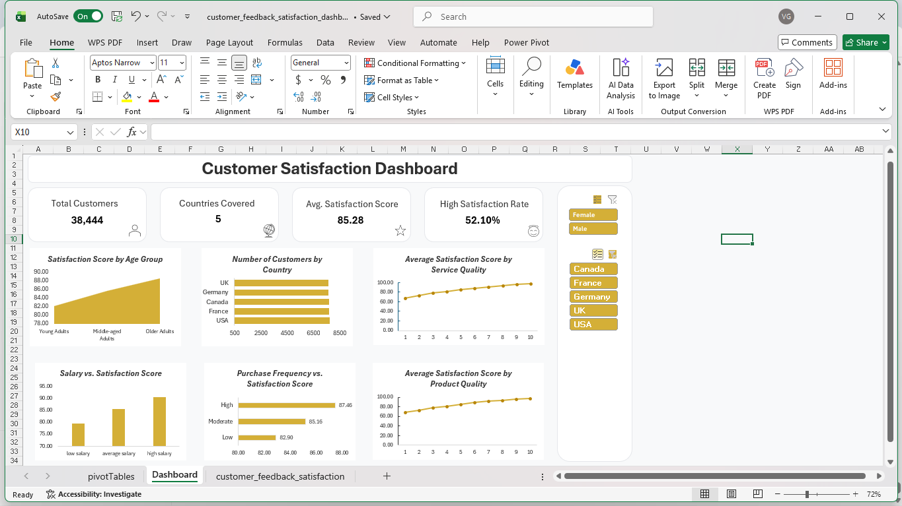

# 📊 Customer Satisfaction Excel Dashboard

> **Interactive Excel dashboard analyzing customer satisfaction, service quality, product quality, purchase frequency, salary, age groups, gender, and country-level trends.**

---

## 📌 Project Overview

This project presents an **interactive Customer Satisfaction Dashboard built in Microsoft Excel**.

The dashboard transforms customer feedback data into meaningful insights using **KPI cards, charts, Pivot Tables, and interactive filters**.

The main objective is to analyze customer satisfaction and understand patterns across different customer and service-related factors.

---

## 🎯 Objectives

- Analyze overall **customer satisfaction**
- Compare satisfaction across different **age groups**
- Analyze satisfaction by **country**
- Understand the relationship between **service quality and satisfaction**
- Analyze **product quality** and customer satisfaction
- Compare satisfaction across different **salary groups**
- Analyze satisfaction based on **purchase frequency**
- Compare customer satisfaction by **gender**

---

## 📊 Dashboard Preview



---

## 📈 Key Performance Indicators

| KPI | Value |
|---|---:|
| 👥 Total Customers | **38,444** |
| 🌍 Countries Covered | **5** |
| ⭐ Average Satisfaction Score | **85.28** |
| 📈 High Satisfaction Rate | **52.10%** |

---

## 📊 Dashboard Features

- 📌 **KPI Cards**
- 📈 **Satisfaction Score by Age Group**
- 🌍 **Customer Count by Country**
- ⭐ **Average Satisfaction Score by Service Quality**
- 💰 **Salary vs. Satisfaction Score**
- 🛒 **Purchase Frequency vs. Satisfaction Score**
- 📦 **Average Satisfaction Score by Product Quality**
- 👥 **Gender Filter**
- 🌎 **Country Filter**

---

## 🔎 Key Insights

- **Older Adult customers** show higher average satisfaction compared with younger age groups.
- Higher **service quality** is associated with higher average satisfaction scores.
- Higher **product quality** is associated with higher customer satisfaction.
- Customers in the **High Salary** group show higher average satisfaction than the Average and Low Salary groups.
- Customers with **High Purchase Frequency** show higher average satisfaction than customers with Moderate and Low Purchase Frequency.
- The dashboard covers customers from **5 countries**, allowing country-level comparison.

> **Note:** These observations represent patterns visible in the dashboard and do not necessarily imply causation.

---

## 🛠️ Tools & Technologies

- **Microsoft Excel**
- **Pivot Tables**
- **Pivot Charts**
- **Slicers**
- **Excel Formulas**
- **Data Cleaning**
- **Data Analysis**
- **Data Visualization**
- **Dashboard Design**

---

## 📂 Repository Structure

```text
customer-satisfaction-excel-dashboard/
│
├── README.md
│
├── Data/
│   ├── raw_dataset.csv
│   └── cleaned_dataset.csv
│
└── Dashboard/
    └── dashboard_preview.png
